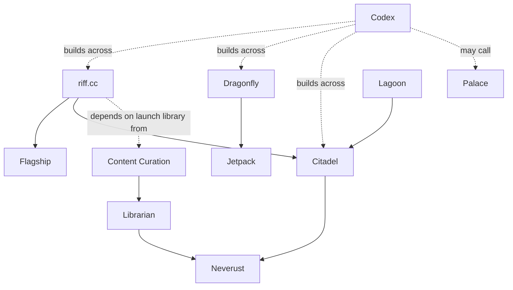

# Project Knowledge

This file now holds the first real public Riff project model rather than just a placeholder.

## Company Spine

Riff Labs is not one product. It is a composable engine of projects that reinforce each other.

The public face and north star is `riff.cc`, but `riff.cc` is only one expression of the engine. The engine underneath it includes:

- `Dragonfly` for provisioning and infrastructure management
- `Jetpack` for automation inside the Dragonfly stack
- `Citadel` for peer-to-peer networking
- `Neverust` for durable storage through the Archivist ecosystem
- `Librarian` for content ingestion and mirroring
- `Codex` as the human-facing agent interface, with `Palace` as a callable tooling layer beneath it
- `Lagoon` as both a product and a proving ground for the P2P layer

## System Families

The portfolio is easier to reason about when grouped into families:

### Public Platform Family

- `riff.cc` is the public expression and long-term reason the company exists
- `Flagship` is the user-facing experience layer
- `Librarian` and `Content Curation` solve the problem of an empty platform

### Network And Storage Family

- `Citadel` is the P2P substrate
- `Neverust` is the durable storage implementation in the Archivist ecosystem
- these two together make the content layer resilient instead of server-bound

### Infrastructure And Commercial Family

- `Dragonfly` is the nearest clear commercial engine
- `Jetpack` is the automation subsystem inside that stack
- `Immortal Infrastructure` is the larger architectural vision they sit inside

### Agentic Development Family

- `Codex` is the human-facing agent interface
- `Palace` is an underlying callable capability layer while useful features migrate upward
- the SoE documents define how planning, execution, automation, and verification are supposed to compose

## Core Project Map

### `riff.cc`

- purpose: censorship-resistant decentralised content delivery network for the open web
- success shape: content is browsable and streamable through a normal web experience while the underlying storage and delivery remain decentralised
- key relationships: composed from `Flagship` + `Citadel`, depends on `Neverust`, `Librarian`, and content curation
- current edge: make the composed stack real enough for pre-alpha rather than talking about a deprecated architecture
- why it exists this way: the public product is intentionally split from its substrate so the platform can feel normal to users while staying peer-to-peer underneath

### `Flagship`

- purpose: the user-facing application layer for `riff.cc`
- success shape: a smooth web and desktop interface for browsing lenses, discovering media, and streaming content
- key relationships: frontend over `Citadel`; consumes storage and catalogue output from `Neverust` and `Librarian`
- current edge: get the frontend working on top of the real Citadel-based architecture
- why it exists this way: the UX layer is separate because `Citadel` is meant to serve more than one application, while `Flagship` is specifically the content-delivery interface

### `Citadel`

- purpose: the general-purpose P2P substrate for Riff applications
- success shape: resilient peer discovery, routing, and content distribution that user-facing apps can rely on without exposing P2P complexity to users
- key relationships: underpins `riff.cc`, `Flagship`, `Lagoon`, and `ETH2077`; stores content through the Archivist/Neverust path
- current edge: move from impressive architecture and crate breakthroughs toward a more operationally real network layer
- why it exists this way: Riff wanted control over routing, peer scoring, topology, and content delivery semantics rather than inheriting the assumptions of libp2p or other general frameworks

### `Neverust`

- purpose: Riff's Rust implementation of the Archivist storage protocol
- success shape: durable storage and retrieval that can back the content layer for `riff.cc`
- key relationships: storage backend for `riff.cc`, ingestion target for `Librarian`, participant in the wider Archivist ecosystem
- current edge: become functionally reliable enough to support real content ingestion and retrieval
- why it exists this way: Riff needs durable storage for its own platform while also benefiting from implementation diversity in the wider Archivist ecosystem

### `Librarian`

- purpose: ingest and mirror content from external sources into the decentralised storage stack
- success shape: `riff.cc` launches with a meaningful catalogue instead of an empty platform
- key relationships: writes into `Neverust`, works alongside `Content Curation`, feeds the content consumed through `riff.cc`
- current edge: become functional early enough that the platform has real material to show
- why it exists this way: a decentralised platform without content is dead on arrival, so ingestion has to be a first-class system rather than an afterthought

### `Dragonfly`

- purpose: end-to-end infrastructure provisioning, lifecycle management, and automation
- success shape: a hosting provider, lab, or infrastructure team can bring hardware online and manage it through one coherent system
- key relationships: commercial infrastructure track; contains `Jetpack`; dogfoods Codex-first agentic development and eventually its own managed infrastructure
- current edge: push core provisioning and fleet workflows toward stable, usable reality
- why it exists this way: Riff needs a revenue engine and also needs serious infrastructure; Dragonfly solves both by being both product and internal substrate

### `Jetpack`

- purpose: the automation subsystem inside Dragonfly
- success shape: provisioning flows directly into ongoing automation, maintenance, and visual workflow execution without handoffs to separate tooling
- key relationships: integrated into `Dragonfly` rather than a separate product; provides the playbook runner and automation agents
- current edge: mature alongside Dragonfly instead of drifting back into a standalone-product story
- why it exists this way: the provisioning-to-automation handoff is where a lot of infrastructure stacks fracture, so Riff keeps them joined

### `Palace`

- purpose: a legacy and transitional tooling layer whose useful capabilities can be called from Codex
- success shape: Codex can invoke Palace capabilities when useful without making humans learn or drive Palace directly
- key relationships: sits beneath Codex, touches codebases and planning/memory integrations, and acts as a source of capabilities to be absorbed over time
- current edge: keep what is useful callable while moving the human-facing workflow decisively toward Codex
- why it exists this way: the value is in the capabilities, not in preserving Palace as the thing people have to use

### `Lagoon`

- purpose: censorship-resistant communication product built on Citadel
- success shape: a community platform with real sovereignty and resilience, while simultaneously pressure-testing the P2P substrate
- key relationships: application on top of `Citadel`; birthplace of several transport/network crates now conceptually belonging in the Citadel layer
- current edge: remain a proving ground and medium-priority product while revenue-critical work ships first
- why it exists this way: it is both a real product direction and a forcing function that exposes weaknesses in the network layer

### `Content Curation`

- purpose: maintain the editorial catalogue of what should be mirrored into the network
- success shape: the launch library is worth browsing rather than technically impressive but empty
- key relationships: chooses what `Librarian` mirrors; directly affects whether `riff.cc` has a reason for users to return
- current edge: keep the quality bar high while building enough catalogue depth for launch
- why it exists this way: indiscriminate mirroring would prove storage capacity, not product value

## Architecture Truths To Preserve

These are the kinds of facts that stop people from building against stale assumptions:

- `riff.cc` is not one codebase. It is a composition.
- `Flagship` is the interface, not the network.
- `Citadel` replaced older Peerbit-based assumptions in the intended architecture.
- the old public docs have drifted in places and can mislead people about the real substrate.
- `Librarian` plus `Content Curation` are not optional polish; they are part of what makes the platform viable.
- `Dragonfly` is not side-quest infrastructure. It is both a real business track and a foundation for dogfooding the broader stack.

## Why These Splits Exist

### Why `riff.cc` is split from `Flagship` and `Citadel`

The user-facing product and the network substrate have different jobs. Splitting them keeps the UX free to feel normal while letting the network layer evolve as a reusable system that can also power `Lagoon` and future projects.

### Why `Citadel` is custom

The vault's architecture notes make the reason clear: Riff wanted specific control over routing, peer scoring, topology, and content semantics. A custom protocol stack is a trade against interoperability in favor of behavior control for a cohesive internal ecosystem.

### Why `Dragonfly` matters so much

`riff.cc` is the public north star, but `Dragonfly` is the clearest near-term commercial path. That is why the infrastructure product and the public platform coexist rather than one replacing the other.

### Why `Librarian` and `Content Curation` are separate

One is technical ingestion. The other is editorial judgment. Mixing them would blur two very different kinds of work and make it harder to reason about quality versus transport.

### Why the company uses parallel streams

The operating docs are explicit: the problem is not too many projects existing; it is a lack of orchestration. The system is designed so many streams can move at once with shared visibility instead of being artificially serialized into a fake pipeline.

## System Relationships

The relationship model to preserve is:

- `riff.cc` is the north star and public expression
- `Flagship` is the presentation layer for `riff.cc`
- `Citadel` is the networking substrate for `riff.cc`, `Lagoon`, and other future systems
- `Neverust` is the durable storage layer feeding the content side of the network
- `Librarian` and `Content Curation` solve the cold-start content problem instead of pretending the platform can launch empty
- `Dragonfly` and `Jetpack` are the commercial infrastructure track
- `Codex` is the primary human-facing agent interface across the portfolio
- `Palace` is a callable capability layer under Codex rather than the thing humans should drive directly

## Model Constraints

Any grounded project knowledge in this skill should stay:

- public-safe
- positive rather than negation-driven
- compact enough to navigate quickly
- rich enough to explain why the parts fit together
