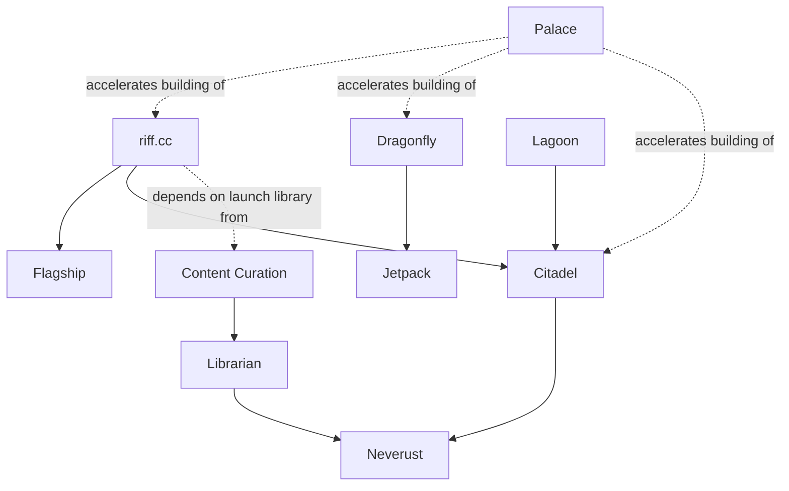

# Project Knowledge

This file now holds the first real public Riff project model rather than just a placeholder.

## Company Spine

Riff Labs is not one product. It is a composable engine of projects that reinforce each other.

The public face and north star is `riff.cc`, but `riff.cc` is only one expression of the engine. The engine underneath it includes:

- `Dragonfly` for provisioning and infrastructure management
- `Jetpack` for automation inside the Dragonfly stack
- `Citadel` for peer-to-peer networking
- `Neverust` for durable storage through the Archivist ecosystem
- `Librarian` for content ingestion and mirroring
- `Palace` for agentic development and command-surface orchestration
- `Lagoon` as both a product and a proving ground for the P2P layer

## Core Project Map

### `riff.cc`

- purpose: censorship-resistant decentralised content delivery network for the open web
- success shape: content is browsable and streamable through a normal web experience while the underlying storage and delivery remain decentralised
- key relationships: composed from `Flagship` + `Citadel`, depends on `Neverust`, `Librarian`, and content curation
- current edge: make the composed stack real enough for pre-alpha rather than talking about a deprecated architecture

### `Flagship`

- purpose: the user-facing application layer for `riff.cc`
- success shape: a smooth web and desktop interface for browsing lenses, discovering media, and streaming content
- key relationships: frontend over `Citadel`; consumes storage and catalogue output from `Neverust` and `Librarian`
- current edge: get the frontend working on top of the real Citadel-based architecture

### `Citadel`

- purpose: the general-purpose P2P substrate for Riff applications
- success shape: resilient peer discovery, routing, and content distribution that user-facing apps can rely on without exposing P2P complexity to users
- key relationships: underpins `riff.cc`, `Flagship`, `Lagoon`, and `ETH2077`; stores content through the Archivist/Neverust path
- current edge: move from impressive architecture and crate breakthroughs toward a more operationally real network layer

### `Neverust`

- purpose: Riff's Rust implementation of the Archivist storage protocol
- success shape: durable storage and retrieval that can back the content layer for `riff.cc`
- key relationships: storage backend for `riff.cc`, ingestion target for `Librarian`, participant in the wider Archivist ecosystem
- current edge: become functionally reliable enough to support real content ingestion and retrieval

### `Librarian`

- purpose: ingest and mirror content from external sources into the decentralised storage stack
- success shape: `riff.cc` launches with a meaningful catalogue instead of an empty platform
- key relationships: writes into `Neverust`, works alongside `Content Curation`, feeds the content consumed through `riff.cc`
- current edge: become functional early enough that the platform has real material to show

### `Dragonfly`

- purpose: end-to-end infrastructure provisioning, lifecycle management, and automation
- success shape: a hosting provider, lab, or infrastructure team can bring hardware online and manage it through one coherent system
- key relationships: commercial infrastructure track; contains `Jetpack`; dogfoods Palace-style development and eventually its own managed infrastructure
- current edge: push core provisioning and fleet workflows toward stable, usable reality

### `Jetpack`

- purpose: the automation subsystem inside Dragonfly
- success shape: provisioning flows directly into ongoing automation, maintenance, and visual workflow execution without handoffs to separate tooling
- key relationships: integrated into `Dragonfly` rather than a separate product; provides the playbook runner and automation agents
- current edge: mature alongside Dragonfly instead of drifting back into a standalone-product story

### `Palace`

- purpose: the unified command surface for agentic development across Riff
- success shape: humans and agents can read/write code, interact with tools, update planning systems, and write back context through one consistent stack
- key relationships: connects codebases, Plane, and Obsidian; enables the operating model rather than serving one product only
- current edge: become standard for more than one operator and support asynchronous agent coordination cleanly

### `Lagoon`

- purpose: censorship-resistant communication product built on Citadel
- success shape: a community platform with real sovereignty and resilience, while simultaneously pressure-testing the P2P substrate
- key relationships: application on top of `Citadel`; birthplace of several transport/network crates now conceptually belonging in the Citadel layer
- current edge: remain a proving ground and medium-priority product while revenue-critical work ships first

### `Content Curation`

- purpose: maintain the editorial catalogue of what should be mirrored into the network
- success shape: the launch library is worth browsing rather than technically impressive but empty
- key relationships: chooses what `Librarian` mirrors; directly affects whether `riff.cc` has a reason for users to return
- current edge: keep the quality bar high while building enough catalogue depth for launch

## System Relationships

The relationship model to preserve is:

- `riff.cc` is the north star and public expression
- `Flagship` is the presentation layer for `riff.cc`
- `Citadel` is the networking substrate for `riff.cc`, `Lagoon`, and other future systems
- `Neverust` is the durable storage layer feeding the content side of the network
- `Librarian` and `Content Curation` solve the cold-start content problem instead of pretending the platform can launch empty
- `Dragonfly` and `Jetpack` are the commercial infrastructure track
- `Palace` is the multiplier that makes the whole portfolio buildable by a small team

## Model Constraints

Any grounded project knowledge in this skill should stay:

- public-safe
- positive rather than negation-driven
- compact enough to navigate quickly
- rich enough to explain why the parts fit together
